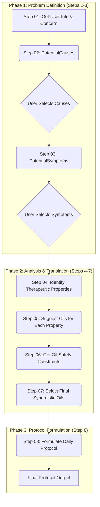

# AI-Powered Holistic Protocol Generator

## 1. Project Vision

This project is an advanced, multi-step AI system designed to generate personalized, safe, and holistic essential oil protocols for end-users.

Starting with a user's single health concern, the system emulates the reasoning process of a team of experts—including a holistic advisor, a safety expert, and a master aromatherapist—to produce a comprehensive daily wellness plan. The final output is a detailed protocol with specific oil blends and application instructions for morning, daytime, and night, tailored to the user's unique profile and needs.

---

## 2. Core Philosophy

The architecture is built on four foundational principles:

* **User-in-the-Loop:** The system is not a black box. It actively engages the user at critical junctures to select their perceived causes and symptoms, ensuring the final protocol is deeply personalized and relevant to their experience.
* **Safety-First Design:** Safety is not an afterthought. The system incorporates a dedicated, explicit step to retrieve objective safety data for every potential oil. This data is then used to filter out inappropriate candidates *before* the final recipe is formulated.
* **Holistic & Synergistic:** The goal is to move beyond simple, one-to-one recommendations. The system is designed to understand the interconnectedness of mind and body, select a "team" of oils that work synergistically, and create a balanced protocol that supports the user's natural daily energy cycles.
* **Modular Architecture:** Each step in the workflow has a single, clear responsibility. This "separation of concerns" makes the system more robust, auditable, and easier to maintain or upgrade over time. Each AI agent (persona) is an expert in its specific task.

---

## 3. System Workflow

The system operates in a three-phase sequence, using a deliberate **Divergent-Convergent Funnel Strategy** to transform a broad user query into a specific, actionable protocol. It systematically alternates between brainstorming possibilities and refining the focus based on analysis and user input.

* **Divergence (Brainstorming):** The process begins by casting a wide net, generating a broad list of potential causes and symptoms related to the user's health concern.
* **Convergence (Refinement & Translation):** The user narrows the focus by selecting the most relevant items. The system then converges further by translating this information into a specific set of required therapeutic properties.
* **Divergence (Expansion):** The system expands again, finding all possible essential oils that match the required properties. This is done to "open the vision" and gather a comprehensive dataset of candidates.
* **Convergence (Synthesis & Formulation):** In the final phase, the system converges decisively. It filters all candidates through a safety check, analyzes the remaining options for synergy, selects the single best "team" of oils, and formulates the final, targeted daily protocol.

### Visual Workflow Diagram

### Phase 1: Problem Definition

* **Step 01 & 02: `PotentialCauses`**
    * **Input:** User's `health_concern` and `userInfo`.
    * **Action:** A "Holistic Advisor" AI brainstorms potential underlying causes (physical, emotional, environmental) tailored to the user's profile.
    * **User Interaction:** The user reviews this list and selects the causes they feel are most relevant.

* **Step 03: `PotentialSymptoms`**
    * **Input:** The `health_concern` and the user's `selected_causes`.
    * **Action:** A "Symptom Correlator" AI identifies common symptoms associated with the health concern, prioritizing those linked to the selected causes.
    * **User Interaction:** The user selects the most relevant symptoms from this list.

### Phase 2: Analysis & Translation

* **Step 04: `MedicalProperties`**
    * **Input:** The `selected_causes` and `selected_symptoms`.
    * **Action:** An "Expert Researcher" AI translates the user's situation into a list of required *actions* or `therapeutic_properties` (e.g., Analgesic, Anti-inflammatory, Calming), linking each property back to the specific cause or symptom it addresses.

* **Step 05: `SuggestedOils`**
    * **Input:** A single `therapeutic_property`.
    * **Action:** An "Aromatherapist Specialist" AI generates a broad list of essential oils known to possess that specific property, focusing purely on efficacy and deferring safety checks. This is performed for each property identified in the previous step.

* **Step 06: `OilSafetyConstraints`**
    * **Input:** The consolidated list of all suggested oils and the user's `age_category`.
    * **Action:** A "Technical Safety Database" AI retrieves objective safety facts for each oil (e.g., max dilution, phototoxicity, contraindications) without interpretation.

* **Step 07: `FinalSelectedOils`**
    * **Input:** All previous data, including the lists of suggested oils and their safety profiles.
    * **Action:** A "Synergy Expert" AI performs the most critical analysis:
        1.  It first filters the list of all suggested oils, discarding any that are unsafe for the user based on the safety constraints.
        2.  From the remaining "safety-approved" list, it selects the final, optimal "team" of 3-6 oils that work together to provide the most comprehensive and synergistic coverage of all the required therapeutic properties.

### Phase 3: Protocol Formulation

* **Step 08: `DailyRecipesProtocol`**
    * **Input:** The final, curated list of selected oils.
    * **Action:** A "Protocol Designer" AI takes the final palette of oils and builds the user-facing protocol. It considers the energetic properties of the oils (e.g., stimulating vs. calming) to create three distinct recipes with detailed application instructions (e.g., dilution, method) for **Morning**, **Daytime**, and **Night**.

---

## 4. API Integration

The system is designed to be driven via a series of API calls. The workflow is initiated with a call to the first step, and the output of each step provides the necessary input for the next.

### Example API Call

curl --location "${API_BASE_URL}/api/ai/streaming" \
--header 'Content-Type: application/json' \
--header 'Content-Type: application/json' \
--data '{
  "feature": "create-recipe",
  "step": "potential-causes",
  "data": {
    "healthConcern": "chronic anxiety and stress",
    "demographics": {
      "gender": "female",
      "ageCategory": "adult",
      "specificAge": 28,
      "language": "en"
    }
  }
}'