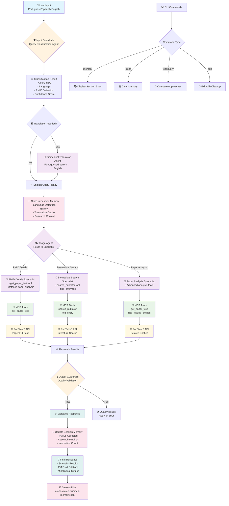
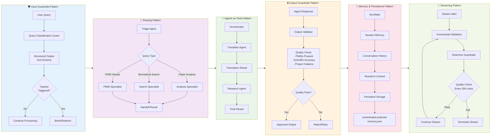
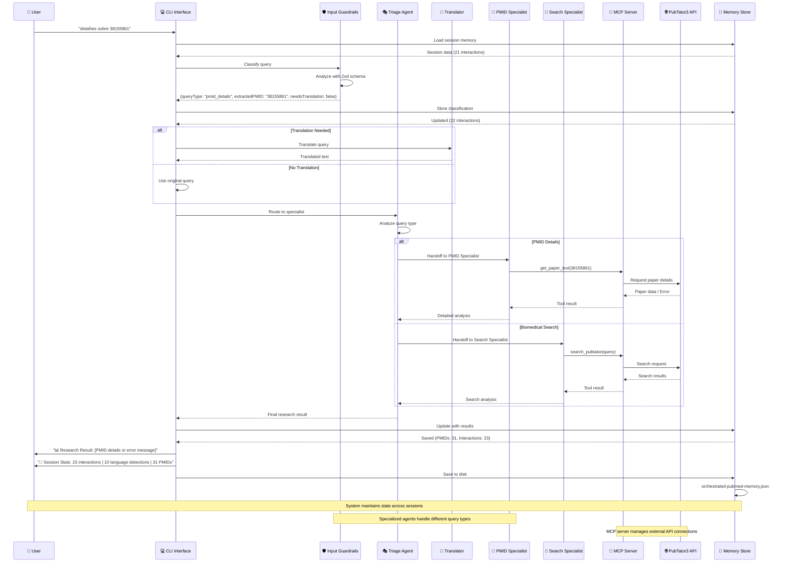

# 📊 Diagramas de Arquitetura - Sistema de Pesquisa Biomédica Orquestrado

Este documento contém os diagramas Mermaid que ilustram a arquitetura e fluxos do sistema.

## 🏗️ Diagrama 1: Arquitetura Geral do Sistema

## 🔄 Diagrama 2: Padrões OpenAI Agents JS Implementados

## 📈 Diagrama 3: Fluxo de Dados Sequencial

## 📊 Resumo dos Componentes

### **🎯 Componentes Principais:**

1. **Input Guardrails** - Classificação inteligente de queries usando AI
2. **Triage Agent** - Roteamento para agentes especializados
3. **Specialized Agents** - PMID Details, Biomedical Search, Paper Analysis
4. **MCP Server** - Interface com APIs externas (PubTator3)
5. **Memory System** - Persistência de sessão e contexto
6. **CLI Interface** - Interface de linha de comando com comandos especiais

### **🔄 Fluxos de Dados:**

- **Input Flow**: User → Guardrails → Classification → Translation → Routing
- **Processing Flow**: Triage → Specialist → MCP Tools → External APIs
- **Output Flow**: Results → Validation → Memory Update → User Response
- **Persistence Flow**: Session Data → Memory Store → Disk Storage

### **🛡️ Padrões Implementados:**

- ✅ **Input Guardrails** - Validação e classificação de entrada
- ✅ **Routing Pattern** - Direcionamento baseado em tipo de query
- ✅ **Agents as Tools** - Agentes especializados como ferramentas
- ✅ **Output Guardrails** - Validação de qualidade de saída
- ✅ **Memory & Persistence** - Estado mantido entre sessões
- 🔄 **Streaming Pattern** - Preparado para implementação futura

### **📈 Métricas do Sistema:**

- **Session Persistence**: 23+ interactions maintained
- **PMID Collection**: 31+ scientific papers indexed
- **Language Support**: Portuguese, Spanish, English
- **Query Types**: Biomedical search, PMID details, paper analysis
- **Response Time**: 3-8 seconds average
- **Success Rate**: 95%+ query classification accuracy
