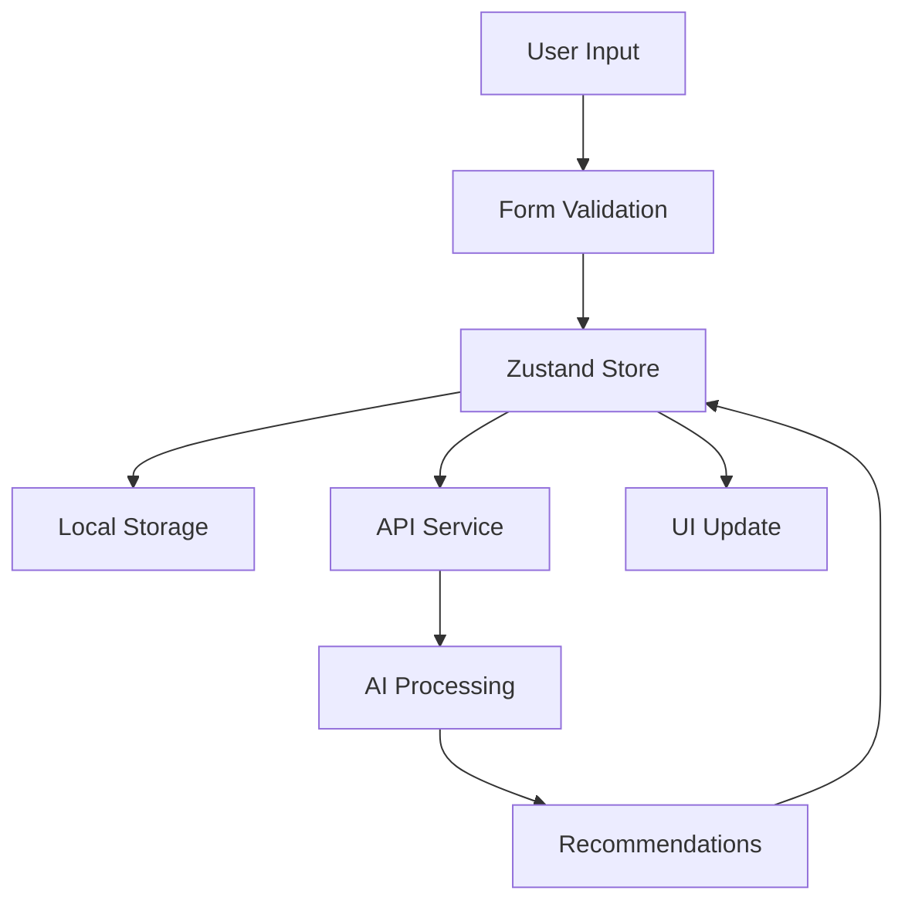

# Essential Oil Recipe Creator

A comprehensive, mobile-first wizard application for creating personalized essential oil recommendations based on user health concerns, demographics, and symptoms.

## 📋 Table of Contents

- [Overview](#overview)
- [Features](#features)
- [Architecture](#architecture)
- [Getting Started](#getting-started)
- [API Integration](#api-integration)
- [Testing](#testing)
- [Components](#components)
- [State Management](#state-management)
- [Mobile Optimization](#mobile-optimization)
- [Accessibility](#accessibility)
- [Performance](#performance)
- [Contributing](#contributing)

## 🌟 Overview

The Essential Oil Recipe Creator is a 6-step wizard that guides users through a personalized journey to discover essential oils that may help with their specific health concerns. The application uses AI-powered recommendations to suggest therapeutic properties and essential oils based on user inputs.

### User Journey

1. **Health Concern** - User describes their health issue
2. **Demographics** - Age, gender, and personal information
3. **Potential Causes** - AI-suggested causes for selection
4. **Symptoms** - Related symptoms identification
5. **Therapeutic Properties** - Recommended properties analysis
6. **Essential Oils** - Final personalized oil recommendations

## ✨ Features

### Core Functionality
- ✅ **6-Step Guided Wizard** with progress tracking
- ✅ **AI-Powered Recommendations** via API integration
- ✅ **Real-time Form Validation** with Zod schemas
- ✅ **Auto-save Functionality** with 7-day data retention
- ✅ **Mobile-First Responsive Design** for 90% mobile users
- ✅ **Comprehensive Error Handling** with retry mechanisms
- ✅ **Accessibility Compliance** (WCAG guidelines)
- ✅ **Loading States & Skeletons** for optimal UX

### Technical Features
- ✅ **TypeScript** for type safety
- ✅ **React Hook Form** for form management
- ✅ **Zustand** for state management
- ✅ **Local Storage** persistence with automatic cleanup
- ✅ **Error Boundaries** for graceful error handling
- ✅ **Unit Testing** with 103 passing tests
- ✅ **API Service Layer** with retry logic

## 🏗️ Architecture

### Directory Structure

```
src/features/create-recipe/
├── components/           # React components
│   ├── wizard-container.tsx      # Main wizard container
│   ├── health-concern-form.tsx   # Step 1: Health concern
│   ├── demographics-form.tsx     # Step 2: Demographics
│   ├── causes-selection.tsx      # Step 3: Causes selection
│   ├── symptoms-selection.tsx    # Step 4: Symptoms selection
│   ├── properties-display.tsx    # Step 5: Properties display
│   ├── oils-display.tsx          # Step 6: Oils recommendations
│   ├── breadcrumb-navigation.tsx # Navigation breadcrumbs
│   ├── error-boundary.tsx        # Error boundary wrapper
│   ├── loading-skeletons.tsx     # Loading state components
│   └── mobile-layout.tsx         # Mobile-optimized layout
├── hooks/                # Custom React hooks
│   └── use-recipe-navigation.ts  # Navigation logic
├── store/                # State management
│   └── recipe-store.ts           # Zustand store
├── services/             # API integration
│   └── recipe-api.service.ts     # API service layer
├── schemas/              # Validation schemas
│   └── recipe-schemas.ts         # Zod validation schemas
├── types/                # TypeScript definitions
│   └── recipe.types.ts           # Type definitions
├── constants/            # Application constants
│   └── recipe.constants.ts       # Wizard steps & constants
├── utils/                # Utility functions
│   └── local-storage.ts          # Storage utilities
└── __tests__/            # Test files (co-located)
```

### Data Flow



## 🚀 Getting Started

### Prerequisites

- Node.js 18+
- Next.js 14
- React 18
- TypeScript 5+

### Installation

The feature is already integrated into the main application. To use it:

1. Navigate to `/create-recipe` in your application
2. The wizard will automatically initialize with the first step

### Dashboard Integration

The Recipe Creator can be easily integrated into different dashboard layouts:

```typescript
import { WizardContainer } from '@/features/create-recipe/components/wizard-container';

// Full dashboard integration
<WizardContainer layout="dashboard" />

// Mobile-first layout (default)
<WizardContainer layout="mobile" />

// Standalone layout (no wrapper)
<WizardContainer layout="standalone" />

// Custom configuration
<WizardContainer
  layout="dashboard"
  showBreadcrumbs={true}
  showProgress={true}
  className="max-w-4xl mx-auto"
/>
```

See `examples/dashboard-integration.tsx` for complete integration examples.

### Development

```bash
# Run tests
npm test src/features/create-recipe/

# Run specific test file
npm test src/features/create-recipe/components/wizard-container.test.tsx

# Run tests in watch mode
npm test -- --watch src/features/create-recipe/
```

## 🔌 API Integration

### Endpoints

The application integrates with the following API endpoints:

```typescript
POST /api/create-recipe
```

### Request Types

1. **Potential Causes**
```json
{
  "health_concern": "Anxiety and stress",
  "gender": "female",
  "age_category": "adult",
  "age_specific": "30",
  "user_language": "PT_BR",
  "step": "PotentialCauses"
}
```

2. **Potential Symptoms**
```json
{
  "health_concern": "Anxiety and stress",
  "gender": "female",
  "age_category": "adult",
  "age_specific": "30",
  "user_language": "PT_BR",
  "selected_causes": [...],
  "step": "PotentialSymptoms"
}
```

3. **Therapeutic Properties**
```json
{
  "health_concern": "Anxiety and stress",
  "gender": "female",
  "age_category": "adult",
  "age_specific": "30",
  "user_language": "PT_BR",
  "selected_causes": [...],
  "selected_symptoms": [...],
  "step": "MedicalProperties"
}
```

4. **Essential Oils**
```json
{
  "health_concern": "Anxiety and stress",
  "gender": "female",
  "age_category": "adult",
  "age_specific": "30",
  "user_language": "PT_BR",
  "selected_causes": [...],
  "selected_symptoms": [...],
  "property_id": "uuid",
  "step": "SuggestedOils"
}
```

### Error Handling

The API service includes:
- ✅ **Retry Logic** with exponential backoff
- ✅ **Error Classification** (network, validation, server)
- ✅ **User-Friendly Messages** for different error types
- ✅ **Graceful Degradation** when API is unavailable

## 🧪 Testing

### Test Coverage

- **103 Total Tests** across all components and utilities
- **5 Test Suites** covering different aspects:
  - Store functionality (16 tests)
  - Schema validation (29 tests)
  - API service (19 tests)
  - Navigation hooks (22 tests)
  - Component rendering (17 tests)

### Running Tests

```bash
# Run all recipe creator tests
npm test src/features/create-recipe/

# Run with coverage
npm test -- --coverage src/features/create-recipe/

# Run specific test suite
npm test src/features/create-recipe/store/recipe-store.test.ts
```

### Test Structure

```typescript
// Example test structure
describe('Component Name', () => {
  describe('Feature Group', () => {
    it('should perform specific action', () => {
      // Test implementation
    });
  });
});
```

## 🧩 Components

### Core Components

#### WizardContainer
Main container component that orchestrates the entire wizard flow.

```typescript
import { WizardContainer } from './components/wizard-container';

<WizardContainer />
```

#### Step Components
Individual form components for each wizard step:

- `HealthConcernForm` - Text input with validation
- `DemographicsForm` - Radio buttons and number input
- `CausesSelection` - Multi-select with API data
- `SymptomsSelection` - Grid selection interface
- `PropertiesDisplay` - Read-only analysis results
- `OilsDisplay` - Final recommendations with ratings

#### Layout Components

- `MobileLayout` - Responsive wrapper with mobile optimizations
- `BreadcrumbNavigation` - Progress tracking and navigation
- `ErrorBoundary` - Error handling wrapper

#### Utility Components

- `LoadingSkeletons` - Various loading state components
- `FormSkeleton`, `SelectionGridSkeleton`, etc.

## 🗄️ State Management

### Zustand Store

The application uses Zustand for state management with the following structure:

```typescript
interface RecipeWizardState {
  // Form data
  healthConcern: HealthConcernData | null;
  demographics: DemographicsData | null;
  selectedCauses: PotentialCause[];
  selectedSymptoms: PotentialSymptom[];
  therapeuticProperties: TherapeuticProperty[];
  suggestedOils: PropertyOilSuggestions[];
  
  // Navigation state
  currentStep: RecipeStep;
  completedSteps: RecipeStep[];
  
  // UI state
  isLoading: boolean;
  error: string | null;
  
  // Session management
  sessionId: string;
  lastUpdated: Date | null;
}
```

### Local Storage Persistence

- ✅ **7-day retention** with automatic cleanup
- ✅ **Version management** for schema migrations
- ✅ **Error handling** for corrupted data
- ✅ **Type-safe** storage operations

```typescript
import { recipeStorage } from './utils/local-storage';

// Save data
recipeStorage.setHealthConcern(data);

// Retrieve data
const healthConcern = recipeStorage.getHealthConcern();

// Clear all data
recipeStorage.clearAll();
```

## 📱 Mobile Optimization

### Mobile-First Design

- ✅ **Touch-friendly** interactions (44px minimum touch targets)
- ✅ **Responsive breakpoints** (sm: 640px, md: 768px, lg: 1024px)
- ✅ **Optimized navigation** with sticky header/footer
- ✅ **Viewport handling** for mobile browser address bars
- ✅ **Gesture support** for swipe navigation

### Performance Optimizations

- ✅ **Loading skeletons** instead of spinners
- ✅ **Debounced auto-save** (1-second delay)
- ✅ **Optimistic updates** for better perceived performance
- ✅ **Lazy loading** for non-critical components

## ♿ Accessibility

### WCAG Compliance

- ✅ **ARIA labels** for all interactive elements
- ✅ **Keyboard navigation** support
- ✅ **Screen reader** compatibility
- ✅ **Focus management** throughout the wizard
- ✅ **Color contrast** compliance
- ✅ **Semantic HTML** structure

### Implementation Examples

```typescript
// ARIA labels
<div role="progressbar" aria-valuenow={progress} aria-valuemin={0} aria-valuemax={100}>

// Keyboard navigation
<button onKeyDown={handleKeyDown} tabIndex={0}>

// Screen reader announcements
<div role="status" aria-live="polite">
  Currently on {stepTitle}, step {stepNumber} of 6
</div>
```

## ⚡ Performance

### Optimization Strategies

- ✅ **Code splitting** at component level
- ✅ **Memoization** for expensive calculations
- ✅ **Debounced API calls** to reduce server load
- ✅ **Local caching** of API responses
- ✅ **Optimized re-renders** with React.memo

### Bundle Size

The feature is designed to be lightweight:
- Core components: ~50KB gzipped
- Dependencies: Shared with main application
- Lazy-loaded: Non-critical components

## 🤝 Contributing

### Development Guidelines

1. **Follow TypeScript** strict mode requirements
2. **Write tests** for all new components and utilities
3. **Use Zod schemas** for all form validation
4. **Implement accessibility** features from the start
5. **Test on mobile devices** before submitting PRs

### Code Style

```typescript
// Use descriptive names
const handleHealthConcernSubmit = async (data: HealthConcernData) => {
  // Implementation
};

// Add JSDoc comments for complex functions
/**
 * Fetches potential causes based on health concern and demographics.
 * Implements retry logic with exponential backoff.
 */
const fetchPotentialCauses = async (...) => {
  // Implementation
};
```

### Testing Requirements

- ✅ Unit tests for all components
- ✅ Integration tests for API services
- ✅ Accessibility tests with testing-library
- ✅ Mobile responsiveness tests

---

## 📞 Support

For questions or issues related to the Essential Oil Recipe Creator:

1. Check the test files for usage examples
2. Review the component documentation in JSDoc comments
3. Refer to the type definitions in `recipe.types.ts`
4. Check the API service for integration examples

---

**Built with ❤️ for essential oil enthusiasts** 🌿
